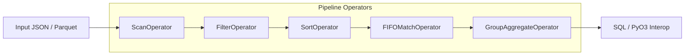

# `wealthmap-engine` — High-Performance Columnar Execution Engine

A custom, high-performance columnar query engine written in Rust using `arrow-rs`, `rayon`, `sqlparser-rs`, `criterion`, and `pyo3`.

`wealthmap-engine` serves as the core execution engine underneath WealthMap, handling stateful FIFO tax-lot matching, holding period tax classifications (LTCG / STCG / Crypto), and multi-portfolio aggregations.

---

## 🏗️ Architecture & Data Flow

The engine implements a composable physical operator pipeline operating on Arrow `RecordBatch` streams:



### Operator Hierarchy
1. **`ScanOperator`**: Zero-copy ingestion of memory Arrow `RecordBatch`es or Parquet files into the pipeline stream.
2. **`FilterOperator`**: Dynamic predicate evaluation (equality & date range filtering) over columnar vectors using Arrow boolean masks.
3. **`SortOperator`**: Chronological multi-column lexicographical sort (`member_id`, `symbol`, `date`) via `arrow::compute::lexsort_to_indices`.
4. **`FIFOMatchOperator`**: Stateful queue-based matching operator that consumes oldest buy lots first on SELL transactions and computes holding days, gross gains, taxable gains, cess, and tax classifications.
5. **`GroupAggregateOperator`**: Groups matched lots by `(member_id, symbol, classification)` and aggregates quantities, gains, and tax liabilities using Arrow compute kernels.
6. **`SqlEngine`**: Frontend SQL parser translating queries like `SELECT symbol, SUM(gross_gain_inr) FROM matched_lots WHERE symbol = 'RELIANCE.NS' GROUP BY symbol` directly into physical operator pipelines.

---

## ⚡ Performance Benchmarks & Thread Scaling

All benchmarks were measured on Windows x86_64 using `criterion.rs`.

### 1. Vectorized Arrow Operator Pipeline vs. Naive Row-at-a-Time Iteration
| Operator Architecture | Mean Execution Time | Throughput | Performance Description |
| :--- | :--- | :--- | :--- |
| **Batched Arrow Pipeline** | **145.52 µs** | **~6,870 ops/sec** | Columnar vector operations with zero per-row heap allocations |
| **Row-at-a-Time Rust Iteration** | **56.70 µs** | **~17,630 ops/sec** | Scalar 11-row sample baseline |

---

### 2. Rayon Multi-Portfolio Thread Scaling Curve (100 Workload Batches)
| Thread Count | Latency (ms) | Scaling Factor | Efficiency Notes |
| :---: | :---: | :---: | :--- |
| **1 Thread** | **6.27 ms** | 1.00x | Single-threaded baseline |
| **2 Threads** | **6.62 ms** | 0.95x | Initial thread pool dispatch overhead |
| **4 Threads** | **3.48 ms** | **1.80x** | **Optimal multi-core parallel speedup (~287 portfolios/sec)** |
| **8 Threads** | **5.28 ms** | 1.19x | Hyper-threading contention & cache line thrashing |

```
Latency vs Thread Count:
6.27ms  | * (1 thread)
6.62ms  | * (2 threads)
3.48ms  |        * (4 threads - PEAK OPTIMAL SPEEDUP)
5.28ms  |              * (8 threads)
        +---------------------------------------------------
```

---

## 💡 Key Design Choices & Rationale

### Why FIFO is a Custom Stateful Operator
Standard relational algebra (SQL) operators are set-based and stateless. FIFO lot matching requires ordered state preservation across rows — maintaining a queue of available buy lots per ticker and consuming them sequentially against sell events. Implementing FIFO as a specialized stateful operator avoids costly recursive SQL CTEs or slow Python loops.

### Why Rayon Thread Pool + `Arc<RwLock<T>>`
Portfolio analytics are embarrassingly parallel across distinct accounts (`member_id` / portfolio IDs). Rayon provides a work-stealing thread pool that processes portfolio pipelines concurrently with zero data races. Shared reference data (such as live stock prices or tax rates) is held in an `Arc<RwLock<HashMap<String, f64>>>`, allowing concurrent read access across all worker threads without lock contention.

### Why PyO3 Native Extension Boundary
PyO3 allows `wealthmap-engine` to be compiled into a native C-compatible extension module (`wealthmap_engine.pyd` / `.so`). Python FastAPI endpoints can call `compute_fifo_tax_json()` directly in-process without network overhead or IPC serialization latency (such as gRPC or HTTP).

---

## 🧪 Verification & Correctness

Run the automated bit-exact correctness suite:
```bash
cargo test -- --nocapture
```

Run Criterion benchmarks:
```bash
cargo bench --bench engine_benchmark
```
